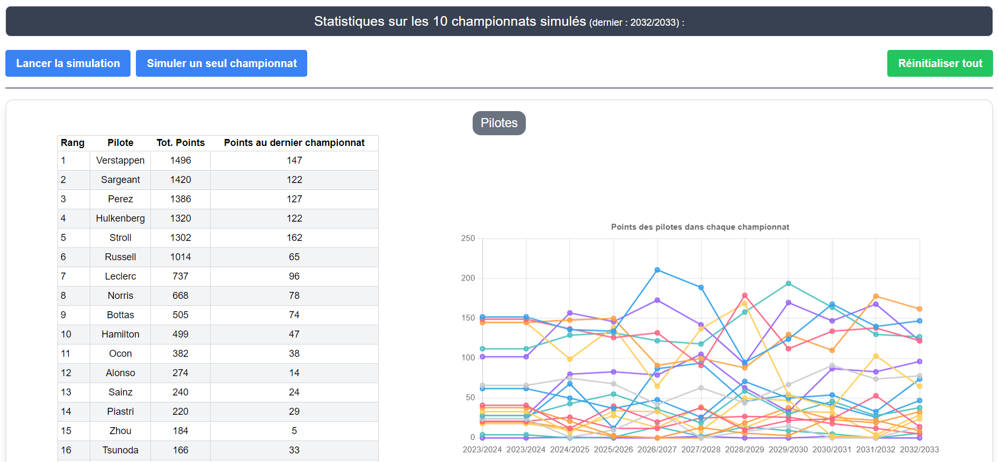
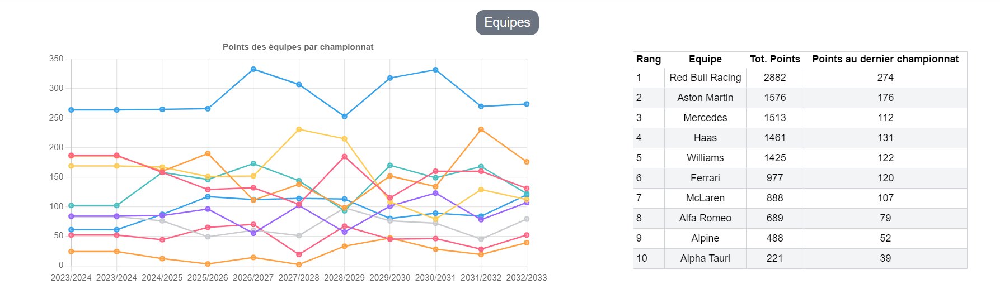
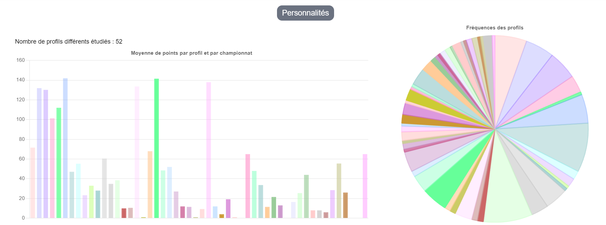
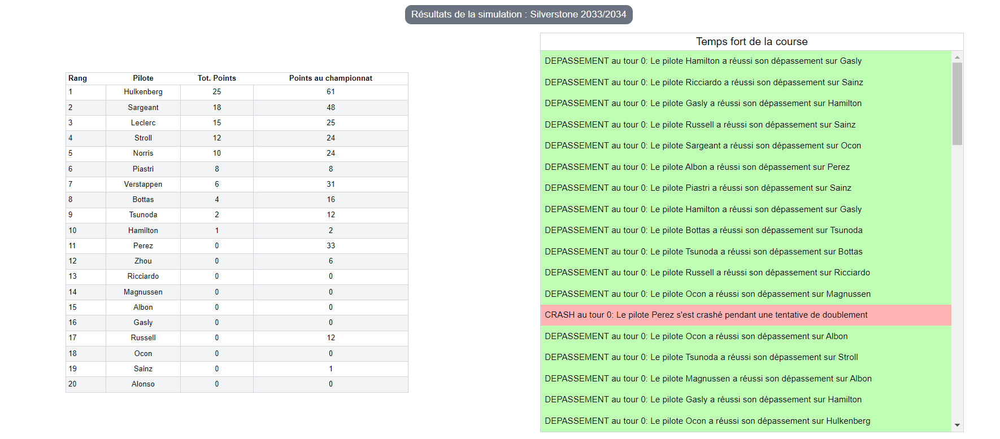
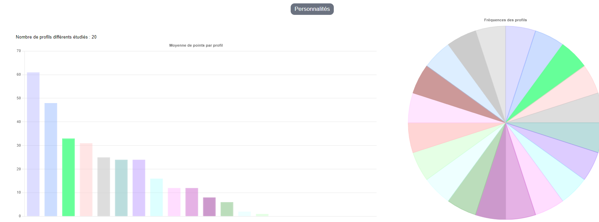
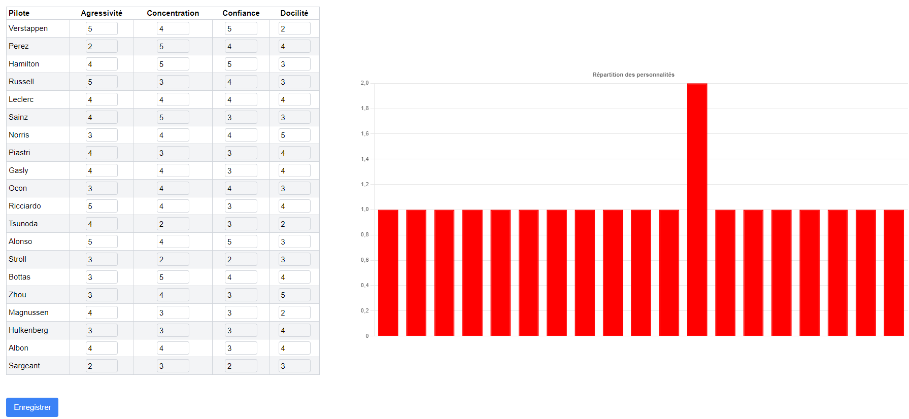

# Formula 1 Championship Simulator : study of the impact of personality on the performance of a driver

Project led in the context of the IA04 course at UTC, supervised by S. Lagrue and H. Willot in 2023/2024.
By : Yannis Brena--Label, Adam Hafiz, Hugo Milair, Damien Vaurs

## Generalities

This project is the main project of the IA04 cours **Multi-Agent Systems** at UTC. The aim of the project was to develop a simulation involving several **agents** which communicate with an **environment**. The technology used had to be Go for the backend. It was established by the group that a React frontend would be used.

Our idea was to implement formula 1 races on existing F1 circuits with existing drivers and teams. Performances of drivers in race depend on their intrinsinque level, their car and their personality. The **personality** is divided in **4 Traits** : Agressivity, Concentration, Confidence and Docility. The first two are fixed while the last two are likely to evolve from a race to another, depending on race results, crashes, etc. The goal of the project was to **study the impact of these personality traits on the performance of the drivers**.

Refer to the [project description](#project-description) for more details.

The project was to be developed in 2 to 3 months and got the final grade of 17.5/20.

Original repositories:

* [backend](https://gitlab.utc.fr/vaursdam/formule-1-ia04)
* [frontend](https://gitlab.utc.fr/ybrenala/formule-1-ia04-front)

## Launching the project

### Getting started

The project can be cloned with the following commands:

    git clone https://github.com/milairhu/Formula1-championship-sim.git
**After cloning**, for the frontend, it may be necessary to install dependencies. During our tests, it turned out that the following command was the only one to be executed to be able to correctly launch the project:

    npm i react-chartjs-2

**If the user does not clone the project but obtained the project via the IA04 repository**, all dependencies must be installed:

* navigate to app-react
* run the command *npm install* to install the dependencies.

### Launching the programs

In the command line, the user interface is launched from the *app-react* subdirectory with **npm**:

    npm run start

As for the Go project, the user can either run the program with:

    go run cmd/launch-simulation.go

Or by first installing the executable file:

    go install cmd/launch-simulation.go

The user can then execute the file from their Go directory.

### Remarks and recommendations

For the proper functioning of the user interface, it is imperative that the backend be running. Also, the user must ensure that their **port 8080** is available so that the frontend requests reach the backend correctly.

When using the user interface, it is possible that the graphs may not display correctly in the main tab. We advise the user to click on the *Simuler un seul championnat* button, go to another tab, and then return to the main tab. The graphs will then display correctly during the simulation.

Finally, the **python_plots** folder contains Python scripts for plotting interesting graphs as part of the simulation, but which we did not have time to integrate into the user interface. The user can view these graphs in the same folder. Detailed instructions on using this script are available at the top of the Python file.

## Project Description

### Project Objective

This project aims to address the problem statement **What is the best profile for a driver to score the most points?**. Answering this question would notably, from a team's position, shed light on the driver recruitment strategy in light of their personality.

A personality is defined by 4 character traits that influence the driver's behavior in races. These traits are:

* **Aggressiveness**: determines the driver's propensity to attempt overtaking maneuvers

* **Concentration**: determines the driver's ability to focus on the race
* **Confidence**: determines the driver's level of self-confidence
* **Docility**: determines the driver's docility to the team's instructions

The first two of these traits, once set, do not change during the driver's career. The last two, however, can evolve depending on the driver's performance in races.

The goal of the simulation is thus to **detect which personality is the most performing in a race**. To do this, the user can, through the interface, simulate Formula 1 championships or races and visualize the results of drivers, teams, and different personality profiles. They can also modify the personalities of drivers during the simulation to observe the impact of these changes on the driver's results.
We also advise the user to observe the overperforming drivers in the championships (e.g., the driver Sargeant, despite driving a bad car and having a low intrinsic level, is regularly among the best drivers in our simulations) and to apply their personalities to poorly ranked drivers. The driver will tend to score more points and the user will be able to observe the impact of personality on results.

It should be noted that the presentation of the project to the teachers as well as the graph contained in **python_plots** led to the conclusion that the ideal driver is **not very aggressive**, **not very concentrated**, and **not very docile**. He is also **very confident**.

### Modeling

This project takes into account several elements of Formula 1 championships. The most important ones are:

* the **drivers**, the agents of the simulation, who are characterized by their personality, level, and team. The initial personality traits of each of the 20 drivers were estimated by a keen follower of Formula 1.
* the **circuits** on which the drivers evolve. 12 circuits regularly involved in the championships have been modeled.
* the **races**, which constitute the point of interest of the simulations.

Within the races, certain elements are taken into account:

* the **weather**, whose distribution varies depending on the geographical location of the circuit.
* the **tires**, which if not replaced, may lead to a puncture. The condition of the tires also affects the speed of the drivers.
* **pit stops** which allow changing tires.

Other elements, such as qualifications and free practice sessions, could be added. Also, the model could be improved to best match reality.

## Screenshots of the graphical interface

### Championship Simulation

#### Drivers Statistics

#### Teams Statistics

#### Personalities Statistics

### Race Simulation

#### Race Results

#### Personalities of a Race

### Modifying Personalities

